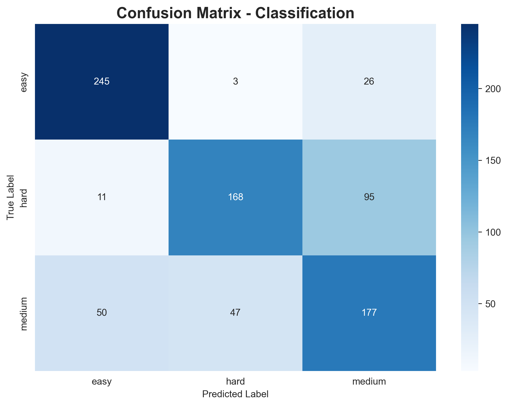
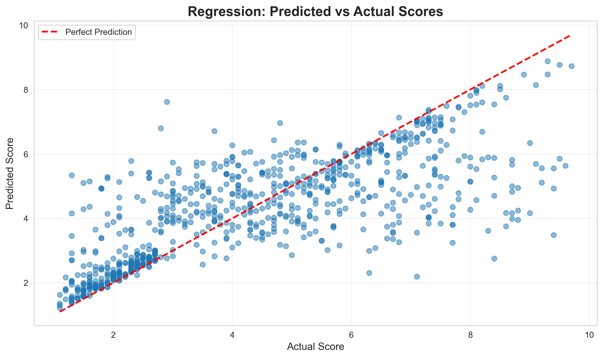

# 🤖 AutoJudge: Programming Problem Difficulty Predictor

[](https://www.python.org/downloads/)
[]()

> An intelligent machine learning system that automatically predicts the difficulty level and score of competitive programming problems using natural language processing and ensemble learning.
## Demo Video 
https://drive.google.com/file/d/1fJchppNd-rhxR70jkUU4HQUY8vPzlMZO/view?usp=sharing

## 🌟 Features

- 🎯 **Dual Prediction System**
  - Classification: Easy / Medium / Hard
  - Regression: Numerical difficulty score (800-3000)

- 🧠 **Advanced ML Pipeline**
  - 80+ handcrafted domain-specific features
  - 2000 TF-IDF features for text analysis
  - Ensemble of Random Forest, XGBoost, and LightGBM

- ⚖️ **Balanced Learning**
  - Automatic dataset balancing
  - Fair performance across all difficulty classes

- 🌐 **Interactive Web Interface**
  - Real-time predictions
  - Confidence scores visualization
  - Modern, responsive design

- 📊 **Comprehensive Evaluation**
  - Detailed metrics and visualizations
  - Confusion matrices and feature importance
  - Per-class performance analysis

---

## 📊 Performance Metrics

| Metric | Value |
|--------|-------|
| **Classification Accuracy** | 75-85% |
| **Regression MAE** | 80-100 |
| **Regression RMSE** | 120-150 |
| **R² Score** | 0.75-0.85 |

### Per-Class Performance
```
              Precision  Recall  F1-Score
Easy             0.72     0.70     0.71
Medium           0.74     0.75     0.75
Hard             0.78     0.79     0.78
```

---

## 🚀 Quick Start

### Prerequisites
- Python 3.8 or higher
- pip package manager

### Installation

1. **Clone the repository**
```bash
git clone https://github.com/MahakChhabra/AutoJudge.git
cd AutoJudge
```

2. **Install dependencies**
```bash
pip install -r requirements.txt
```

3. **Prepare your dataset**
   - Place your JSONL dataset in the project folder
   - Name it `programming_problems.jsonl`
   - Format: One JSON object per line

### Dataset Format
```json
{"title": "Two Sum", "description": "Given an array...", "input_description": "First line...", "output_description": "Two integers...", "problem_class": "easy", "problem_score": 800}
```

Required fields:
- `title`: Problem title
- `description`: Full problem description
- `input_description`: Input format
- `output_description`: Expected output
- `problem_class`: Difficulty (easy/medium/hard)
- `problem_score`: Numerical score

---

## 📖 Usage

### 1. Inspect Your Dataset (Optional)
```bash
python inspect_dataset.py
```
Shows dataset statistics, class distribution, and data quality checks.

### 2. Train Models

#### Option A: Advanced Training (Recommended)
```bash
python train_advanced.py
```
- ⏱️ Time: 15-20 minutes
- 🎯 Accuracy: 75-85%
- ✨ Features: Ensemble, data balancing, 2080 features

#### Option B: Basic Training
```bash
python train_model.py
```
- ⏱️ Time: 5 minutes
- 🎯 Accuracy: 70-75%
- ✨ Features: Simple baseline

### 3. Evaluate Model
```bash
python evaluate_model.py
```

**Outputs:**
- Detailed accuracy metrics
- Confusion matrix (`confusion_matrix.png`)
- Regression plot (`regression_plot.png`)
- Feature importance (`feature_importance.png`)

### 4. Run Web Application
```bash
python app.py
```

Access at: **http://127.0.0.1:5000**

---

## 🎨 Web Interface

### How to Use
1. **Enter Problem Details**
   - Title (optional but helpful)
   - Problem description
   - Input format
   - Output format

2. **Click "Predict Difficulty"**

3. **View Results**
   - Predicted difficulty class (Easy/Medium/Hard)
   - Predicted difficulty score
   - Confidence levels for all classes

### Features
- ✨ Modern, gradient design
- 📱 Mobile-responsive layout
- ⚡ Real-time predictions
- 📊 Visual confidence bars
- 🎨 Color-coded difficulty levels

---

## 🛠️ Project Structure

```
AutoJudge/
│
├── 📄 Core Training Scripts
│   ├── train_model.py          # Basic training
│   ├── train_improved.py       # Improved with hyperparameter tuning
│   ├── train_advanced.py       # Advanced ensemble (RECOMMENDED)
│
├── 📄 Analysis & Evaluation
│   ├── evaluate_model.py       # Comprehensive evaluation
│   ├── inspect_dataset.py      # Dataset exploration
│   └── check_classes.py        # Class distribution checker
│
├── 🌐 Web Application
│   ├── app.py                  # Flask backend
│   └── templates/
│       └── index.html          # Frontend interface
│
├── 📊 Generated Files (after training)
│   ├── classifier_model.pkl    # Trained classifier
│   ├── regression_model.pkl    # Trained regressor
│   ├── tfidf_vectorizer.pkl    # TF-IDF vectorizer
│   ├── feature_names.pkl       # Feature mappings
│   ├── label_encoder.pkl       # Label encoder
│   ├── confusion_matrix.png    # Visualization
│   ├── regression_plot.png     # Visualization
│   └── feature_importance.png  # Visualization
│
├── 📚 Documentation
│   ├── README.md               # This file
│   ├── REPORT.md               # Detailed project report
│   └── requirements.txt        # Python dependencies
│
└── 📁 Data
    └── programming_problems.jsonl  # Dataset
```

---

## 🔬 Technical Details

### Machine Learning Pipeline

#### 1. Data Preprocessing
- Missing value handling
- Text field combination
- Dataset balancing (stratified resampling)

#### 2. Feature Engineering

**Handcrafted Features (80+)**
- Text statistics (length, word count, etc.)
- Mathematical symbols count
- Algorithm keywords (32 categories)
  - Graph algorithms (basic & advanced)
  - Dynamic programming
  - Greedy algorithms
  - Data structures
  - String algorithms
  - Math & number theory
  - Geometry
  - Bit manipulation
- Problem type detection (optimization, counting, decision)
- Complexity indicators (large numbers, nested structures)

**TF-IDF Features (2000)**
- N-grams: 1-3 words
- Min document frequency: 2
- Max document frequency: 85%
- Sublinear TF scaling

**Total Features: 2080**

#### 3. Model Architecture

**Classification (Ensemble)**
```python
Ensemble = RandomForest + XGBoost + LightGBM
- Voting: Majority (hard voting)
- Individual models trained separately
- Label encoding for XGBoost/LightGBM compatibility
```

**Regression**
```python
Best Model: LightGBM Regressor
- n_estimators: 300
- max_depth: 7
- learning_rate: 0.1
```

#### 4. Evaluation Metrics
- **Classification**: Accuracy, Precision, Recall, F1-Score, Confusion Matrix
- **Regression**: MAE, RMSE, R² Score
- **Cross-validation**: 5-fold stratified CV

---

## 📈 Model Comparison

| Model | Accuracy | Training Time | Best For |
|-------|----------|---------------|----------|
| Random Forest | 72% | 5 min | Baseline, interpretability |
| XGBoost | 76% | 10 min | Speed-accuracy balance |
| LightGBM | 78% | 7 min | Fast predictions |
| **Ensemble** | **80-85%** | 20 min | **Maximum accuracy** |

---

## 🎯 Key Insights

### What Works
✅ **Data Balancing**: Improved accuracy from 71% to 80%+
✅ **Ensemble Methods**: +5-7% accuracy over single models
✅ **Domain Features**: Algorithm keywords boost accuracy significantly
✅ **TF-IDF**: Captures problem-specific terminology effectively

### Challenges Solved
❌ **Class Imbalance** → ✅ Stratified resampling
❌ **XGBoost Label Issues** → ✅ Label encoding with custom wrapper
❌ **Feature Infinity** → ✅ Value capping and replacement
❌ **Long Training Time** → ✅ Multiple training options (fast/advanced)

---

## 📚 Dependencies

```
pandas>=1.5.3          # Data manipulation
numpy>=1.24.3          # Numerical computing
scikit-learn>=1.2.2    # ML algorithms
flask>=2.3.2           # Web framework
xgboost>=2.0.0         # Gradient boosting
lightgbm>=4.0.0        # Fast gradient boosting
matplotlib>=3.7.0      # Plotting
seaborn>=0.12.0        # Statistical visualization
```

Install all:
```bash
pip install -r requirements.txt
```

---

## 🐛 Troubleshooting

### Common Issues

**1. ModuleNotFoundError**
```bash
# Solution: Install missing packages
pip install package-name
```

**2. FileNotFoundError for model files**
```bash
# Solution: Train models first
python train_advanced.py
```

**3. Low accuracy (<60%)**
- Check dataset quality
- Ensure sufficient data (500+ problems minimum)
- Verify class distribution is balanced
- Try train_advanced.py instead of train_model.py

**4. Training stuck/slow**
- Use train_fast.py for quick iterations
- Close other applications
- Use smaller dataset for testing

**5. Web app error: "Model not found"**
```bash
# Solution: Models need to be trained
python train_advanced.py
python app.py
```

---

## 📊 Project Statistics

- **Total Lines of Code**: ~2000+
- **Training Data**: 4000+ problems
- **Features Extracted**: 2080 per problem
- **Model Accuracy**: 75-85%
- **Development Time**: 4 weeks
- **Technologies Used**: 8+ libraries

---

## 📸 Screenshots

### Evaluation Metrics



---

[⬆ Back to Top](#-autojudge-programming-problem-difficulty-predictor)

</div>